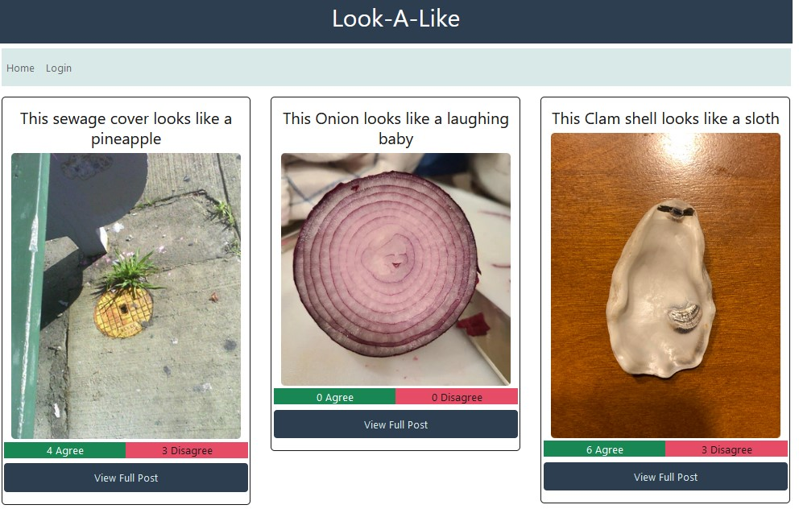

# Look-A-Like 🦈🐬

## Description

Have you ever found a thing (a rock, a grilled sandwich, a pot hole) that looked like something else (a clown, Jesus, a coiled snake)? Ever have issues deciding if it's really there or only you can see it. Well now there is a site that allows for the collection of these images and users are able to vote whether they agree or disagree with what your look-a-like looks like!

Spend hours looking at things that may or may not resemble something else, and feel the power when you log in, vote and make your voice heard.

## Table of Contents

- [Installation](#installation)
- [Usage](#usage)
- [Technology Used](#technologies_used)
- [Credits](#credits)
- [Future Improvement / Development](#Future)
- [License](#license)

## Installation

Download the repo using your method of choice. Open the `schema.sql` located in the `db` directory in a mysql window. Source the Database. Then from the main directory run `npm run seed` to seed the database. Finally run `npm start` and access the site on the port 3001.

## Usage

When users arrive to the site, they are greeted with the most recent posts of objects. Users are able to click on each post to be taken to the post specific page where they can see the image of the object, an image of what the object looks like, and the ability to vote whether you agree or disagree with the user's sentiment.

Users can log in via the log in. Once logged in they are able to navigate to a new post page where they are presented with a form that takes a title, description and accepts two urls. One of the object in question, and one of what it looks like. Hit submit and your post will be added.

## Technologies Used

- Express.js
- Sequelize
- Express Handlebars
- Bootstrap
- mysql2
- bcrypt
- dotenv
- nodemon
- anime.js (new package)

## Credits

- [Will Vining](https://github.com/awvining91) - Handlebars.js, CSS, Presentation core
- [Harrison Burnton](https://github.com/HBurnton/) - Models, Controllers (Routes), Handlebars.js, Frontend Javascript, Heroku and Github, Presentation Deck, Readme
- [Caleb Hernandez](https://github.com/Caleb775) - Form contribution
- [Hezron Teklu](https://github.com/hezron123)

## Future Improvements

Some possible future improvements include:

- Allowing for image upload
- Restricting votes based on time and/or user limits
- Improve/enhance UI

# License

GNU GENERAL PUBLIC LICENSE V3.0
